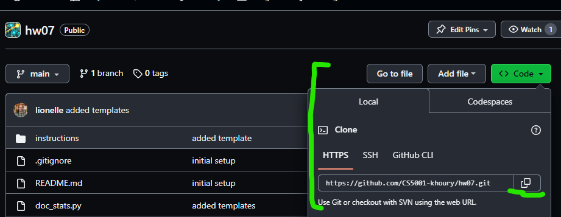
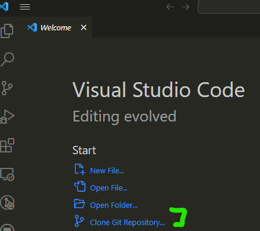
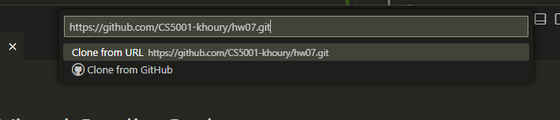

# Homework 07 - Recursion and For Loops

For this homework you will be focusing on recursion and for loops. Additionally, you will explore how projects are often made up of many files, each file (known as a module in python) containing functions that are related to each other in some way. 

## Provided Code and Files
For this assignment, there are four files provided to you.
* [doc_stats.py](../doc_stats.py) - this is the main "driver" of the program. In fact, it's only purpose is to run this particular program. All code is provided, no need to edit. 
* [doc_view.py](../doc_view.py) - this file contains all the interaction with the client (print and input). The "view" is often used in a lot of design paradigms, as the layer that interacts with the client. By containing your interaction to the view layer, it is easier to swap out the different modalities in which one interacts (console, websites, mobile apps, VR, etc) without having to modify the entire program. All code is provided, no need to edit.
* [word_lib.py](../word_lib.py) - This file contains three functions that gives you information about a word. The function signatures (def, and docstring) are provided, but you will need to implement the function bodies. While they can be implemented with loops, we are asking you to implement them recursively to practice recursion.
* [doc_stats_builder.py](../doc_stats_builder.py) - This file contains the function that builds various statistics about a "document" (a documents is a list of text strings). The function signatures (def, and docstring) are provided, but you will need to implement the function bodies. In this case, for-in loops are the best way to implement these functions, and we are encouraging you to use them to practice for-in loops. 

While it is optional, you may want to consider using Git to copy the code to your computer. See the [Resources](#resources) section for more information. Throughout the rest of the semester are going to build up to you using github, as that is the standard for later courses and the industry standard. Right now, it is optional! 

## Part 1: word_lib.py

👉🏽 **Task**: Implement the three functions in [word_lib.py](../word_lib.py) recursively.

## Part 3: README.md

👉🏽 **Task**: Answer the questions in the [README.md](../README.md) file. 

Make sure to answer the questions in the [README.md](../README.md) file.

As always you are free to ask about the questions in MS Teams, including clarifications on the code. 

## 📝 Grading Rubric

While we provide tests, reminder, you should test your own code before submitting!

1. Learning (AG)
   * 
2. Approaching  (AG)
   * 
3. Meets  (AG)
   * 
4. Exceeds  (MG)
   * README.md questions answered
   * Proper comments and docstrings throughout code
  

AG - Auto-graded  
MG - Manually graded

### Submission Reminder 🚨
For manually graded elements, we only guarantee time to submit for a regrade IF you submit by the DUE DATE. Submitting late may mean it isn't possible for the MG to be graded before the AVAILABLE BY DATE, removing any windows for your to resubmit in time. While it will be graded, it is always best to submit by the due date, so you have full opportunity to improve your grade.

## 📚 Resources

### Using Git To Copy The Code

Did you know it is possible to "clone" the entire git repository to your computer? This is a great way to get the code, and then you can use VS Code or PyCharm to edit the files.

First you will need to make sure git is installed on your computer, though often the installs for VS Code and PyCharm adds their own git version. If for some reason they didn't, you can install git here: https://git-scm.com/downloads

To clone using VS Code, open a new window and click "Clone Git Repository" and paste in the URL from the "Code" button on the [main page](../) of the repository. 

The button to find the repository URL is the green code button. 

If you have VS Code, for PyCharm it is "GET FROM VCS" in the new project window.

Just because the dialog is easy to  miss. 

Doing this will copy the entire repo including instructions to your local machine! You will find there are multiple extensions you may want to install as you use them. Feel free to discuss them in teams Tips, Tricks, and Resources!